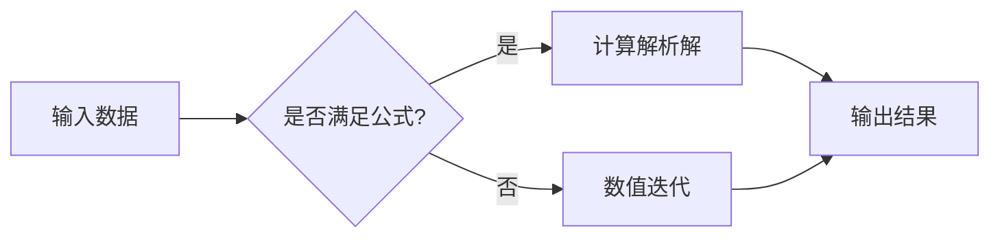

# 综合 Markdown 示例：数学、图表与代码

这是一个带数学公式的综合 Markdown 文档，可用于 VitePress、Typora、Obsidian 等支持 LaTeX 与 Mermaid 的环境。

## 1. 行内公式

爱因斯坦质能方程是 $E = mc^2$，勾股定理是 $a^2 + b^2 = c^2$。

高斯定律的微分形式为 $\nabla \cdot \mathbf{E} = \frac{\rho}{\varepsilon_0}$。

## 2. 块级公式

### 2.1 一元二次方程求根公式

$$
x = \frac{-b \pm \sqrt{b^2 - 4ac}}{2a}
$$

### 2.2 欧拉恒等式

$$
e^{i\pi} + 1 = 0
$$

### 2.3 高斯积分

$$
\int_{-\infty}^{\infty} e^{-x^2} \, dx = \sqrt{\pi}
$$

### 2.4 矩阵与行列式

$$
\mathbf{A} = \begin{pmatrix}
a_{11} & a_{12} \\
a_{21} & a_{22}
\end{pmatrix}, \quad
\det(\mathbf{A}) = a_{11}a_{22} - a_{12}a_{21}
$$

### 2.5 傅里叶变换

$$
\hat{f}(\xi) = \int_{-\infty}^{\infty} f(x) e^{-2\pi i x \xi} \, dx
$$

### 2.6 泰勒展开

$$
f(x) = \sum_{n=0}^{\infty} \frac{f^{(n)}(a)}{n!} (x-a)^n
$$

### 2.7 贝叶斯公式

$$
P(A \mid B) = \frac{P(B \mid A) P(A)}{P(B)}
$$

### 2.8 多行对齐

$$
\begin{aligned}
\nabla \times \mathbf{B} &= \mu_0 \mathbf{J} + \mu_0 \varepsilon_0 \frac{\partial \mathbf{E}}{\partial t} \\
\nabla \cdot \mathbf{E} &= \frac{\rho}{\varepsilon_0}
\end{aligned}
$$

### 2.9 极限与求和

$$
\lim_{n \to \infty} \left(1 + \frac{1}{n}\right)^n = e
$$

$$
\sum_{k=1}^{n} k = \frac{n(n+1)}{2}
$$

### 2.10 期望

$$
\mathbb{E}[X] = \int_{-\infty}^{\infty} x f_X(x) \, dx
$$

## 3. 符号表

| 符号 | 含义 | LaTeX |
| --- | --- | --- |
| $E$ | 能量 | `E` |
| $m$ | 质量 | `m` |
| $c$ | 光速 | `c` |
| $\pi$ | 圆周率 | `\pi` |
| $\int$ | 积分 | `\int` |
| $\sum$ | 求和 | `\sum` |
| $\nabla$ | 梯度算子 | `\nabla` |

## 4. 代码示例

下面用 Python 计算一元二次方程的根：

```python
import numpy as np

def quadratic(a, b, c):
    disc = b**2 - 4*a*c
    if disc < 0:
        return None
    sqrt_disc = np.sqrt(disc)
    return (-b + sqrt_disc) / (2*a), (-b - sqrt_disc) / (2*a)

print(quadratic(1, -3, 2))  # (2.0, 1.0)
```

## 5. Mermaid 流程图



## 6. 任务列表

- [x] 写出数学公式
- [x] 添加代码示例
- [ ] 验证所有公式
- [ ] 补充数值实验

## 7. 引用

> 数学是科学的女王，数论是数学的女王。  
> —— 高斯

## 8. 链接与脚注

这是一个外部链接：[VitePress 官网](https://vitepress.dev/)。

这里有一个脚注引用[^1]。

[^1]: 脚注内容：数学公式通常由 MathJax 或 KaTeX 渲染。
