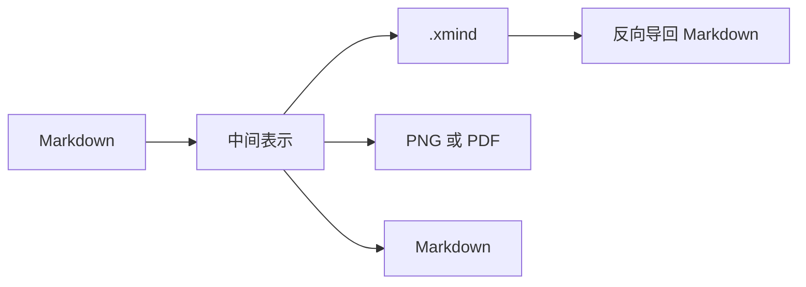

# md工具功能总览

一份覆盖全部语法的演示文稿：在左侧改写这段文字，右侧三视图与导出结果会同步更新。

> Front-matter 的 `title` 会成为中心主题。这个 H1 与它同名，因此被并进中心主题，不会再多出一个重复分支。

## 一、标题映射层级

Markdown 的 `##` 到 `######` 一路往下，就是导图的层级。

### 三级标题 A

#### 四级标题 A1

### 三级标题 B

##### 五级标题 B1

> 从三级直接跳到五级也没问题：跳级标题挂到最近的祖先（三级标题 B）下面，不会掉回根。

## 二、列表与任务

- 无序列表 → 子节点
  - 嵌套一层
    - 嵌套两层
- 同级第二项

1. 有序列表 → 子节点
2. 第二项
   1. 嵌套有序项

- [x] 已完成任务：XMind 里带 task-done 标记
- [ ] 待办任务
  - [ ] 先把文档补全
  - [x] 先把测试跑通

## 三、富文本与备注

段落会变成一个独立的子主题，和标题、列表共处同一棵树。

> 引用与代码块这类整块内容进主题的 notes，Markdown 源码原样保留。

```ts
const total = 1 + 2;
console.log(total);
```

预览专用的行内标记也支持：==高亮==、++插入++、^上标^ 与 ~~删除线~~[^1]。

> 这些符号导出到 XMind 时保留原样：标题一律输出纯文本，换取客户端最大兼容性。

## 四、表格

| 语法 | 思维导图里 | 说明 |
| --- | --- | --- |
| 标题 | 层级 | 级别越小越靠上 |
| 列表 | 子节点 | 缩进即层级 |
| 引用 | notes | 保留 Markdown 源码 |
| 代码块 | notes | 连语言围栏一起保存 |

## 五、链接与图片

- [跳转到「六、公式」](#六公式)

> 整行只有一个链接时，地址会挂到主题的 href；图片则以 Markdown 形式留在 notes 里。
> 示例用的是文档内锚点，不填外部地址 —— 在预览里点它不会把应用跳走。


## 六、公式

行内公式 $E = mc^2$ 直接留在标题里，导图画布会把它排成真正的公式。

### 块级公式

$$
\int_{-\infty}^{\infty} e^{-x^2} \, dx = \sqrt{\pi}
$$

## 七、图表



```chart
{
  "type": "bar",
  "data": {
    "labels": ["XMind", "PNG", "PDF", "Markdown"],
    "datasets": [
      { "label": "支持的导出格式", "data": [4, 3, 3, 2], "backgroundColor": "#2e75b6" }
    ]
  },
  "options": { "plugins": { "legend": { "display": false } } }
}
```

## 八、参考

写完后用工具栏导出任意格式：`.xmind`、JSON、Markdown、PNG、PDF，导出所见即所得。

[^1]: 脚注在「Markdown 预览」里渲染成可跳转的注释。
